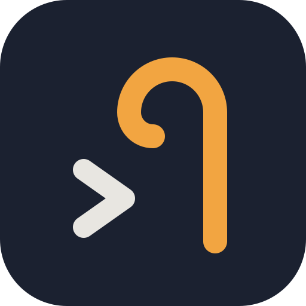

<p align="center"></p>
<h1 align="center">herdsman</h1>

A terminal workspace for running coding agents: workspaces, tabs and panes, SSH-connected
machines, and agents recognised by state in the sidebar. On top of that, **stacked panes**:
one layout slot holds several panes and shows one at a time, while the hidden ones keep running.

herdsman is a modified version of [herdr](https://github.com/herdrdev/herdr), renamed into a
separate app and extended. It is not affiliated with or endorsed by herdr. See [NOTICE](NOTICE).

## Status

A personal fork, not yet published. There are no releases, and the update and install URLs are
placeholders, so `herdsman update` and remote installs fail without fetching anything.

## How it differs from herdr

- **Its own app.** The binary, `~/.config/herdsman`, the socket, the `HERDSMAN_*` environment
  variables and the agent hooks all carry herdsman's name, so herdsman and herdr run side by side
  without sharing anything.
- **Stacked panes.** `prefix+alt+c` puts a new pane behind the current one, and a strip along
  the slot switches between them. [fork/stacks.md](fork/stacks.md) has the keys, CLI and
  behaviour.

## Building

```bash
cargo build --release --locked     # binary at target/release/herdsman
```

The vendored libghostty-vt needs Zig 0.16.0 on `PATH`.

## Documentation

- [fork/](fork/README.md): the fork: its design, what was built, and how herdr releases are
  merged in.
- `docs/next/`: the user documentation inherited from herdr, renamed.
- `herdsman --help` for the CLI, and `herdsman --skill` for the agent skill.

## Licence

Apache License 2.0, as herdr. See [LICENSE](LICENSE) and [NOTICE](NOTICE).
